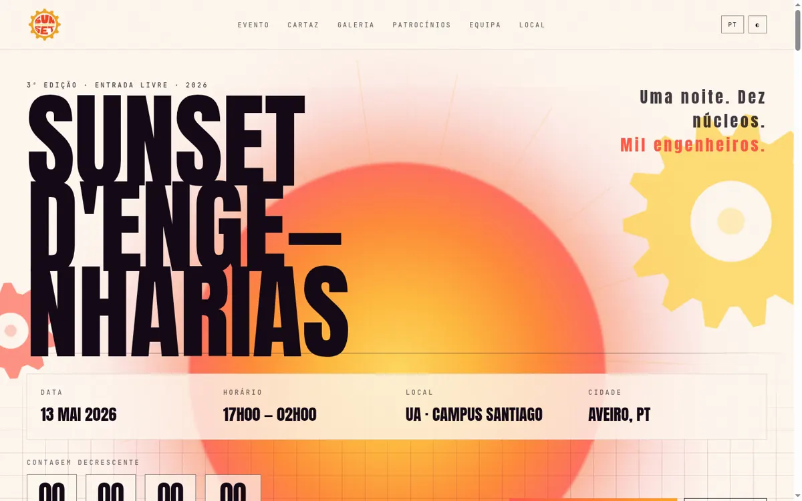
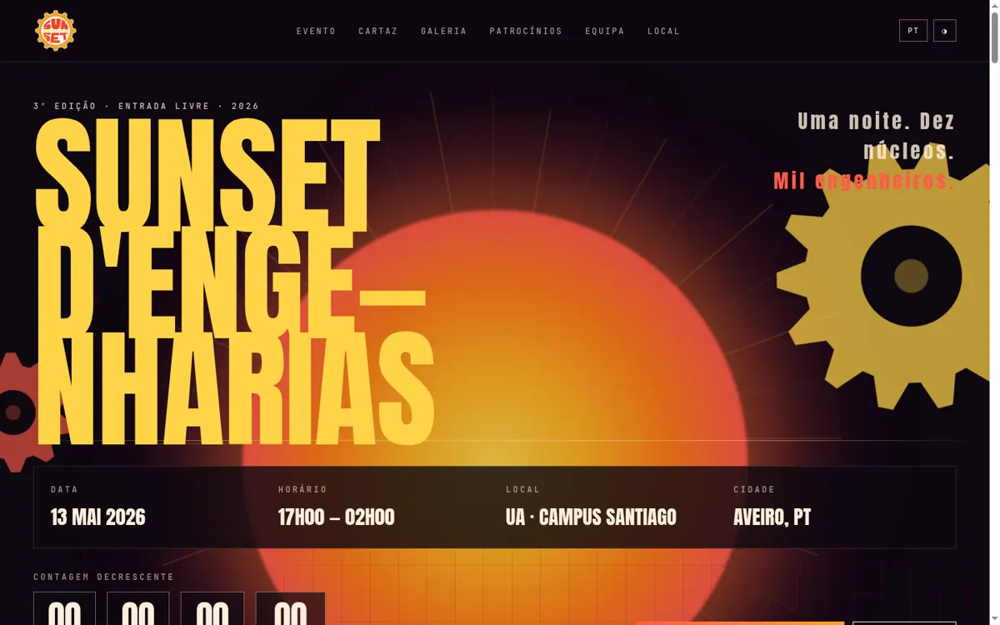
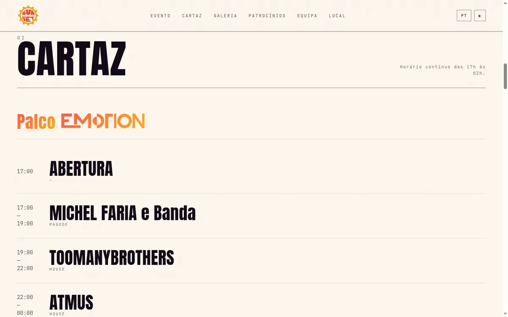
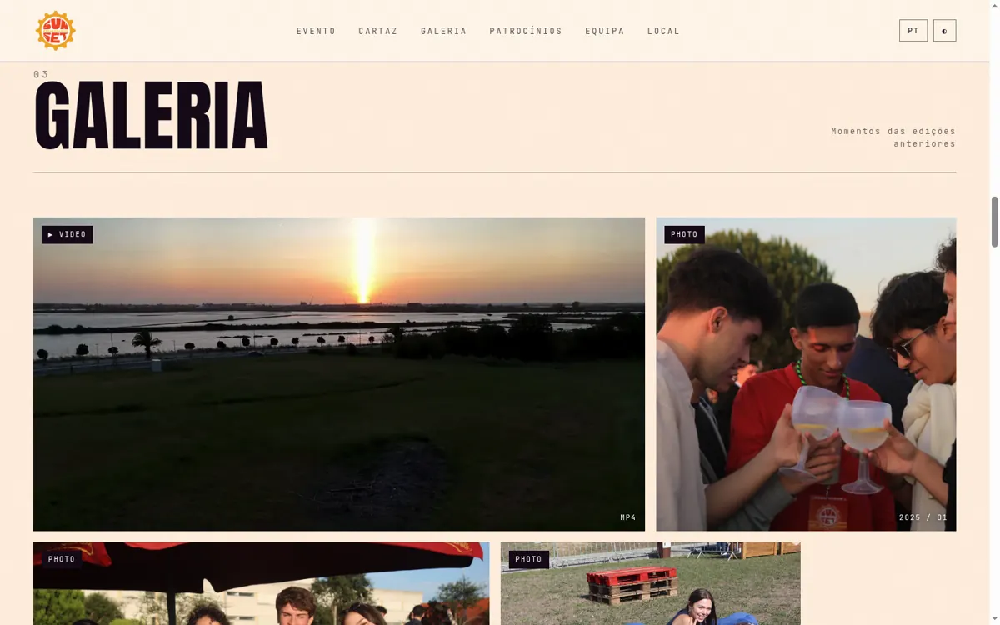

# Sunset d'Engenharias 2026

Microsite for **Sunset d'Engenharias**, the festival run jointly by the ten engineering student bodies (*núcleos*) of the Universidade de Aveiro. Third edition: 13 May 2026, Campus de Santiago, free entry, 17h00 → 02h00.

Live: <https://sunset-eng.vercel.app>



| | |
|---|---|
|  |  |
| **Dark theme.** Theme lives on `<html data-theme>` and every colour re-cascades from CSS custom properties. | **Lineup.** All copy comes from `src/content.js`; no strings are hard-coded in components. |



---

## Quick start

```sh
npm install
npm run dev          # http://localhost:3000
npm run build        # production build → dist/
npm run preview      # serve the production build
npm run lint         # eslint (flat config, react + react-hooks)
```

Node 18+. There is no test suite; `npm run lint` and `npm run build` are the gate.

## Stack

- **Vite 5** + **React 18** — a single-page site, no router, no server
- **Tailwind CSS v4** via `@tailwindcss/vite`, CSS-first with `@theme`
- **p5.js** — the animated sun rays in the hero (lazy-loaded, see below)
- **react-leaflet** — venue map
- **@vercel/analytics**
- Hosted on **Vercel**

## Layout of the repo

```
docs/               screenshots used by this README
brand-assets/       sponsor-supplied vector originals (PDF) — deliberately NOT in public/
public/
  gallery/          event photos (WebP) + drone video and its poster frame
  nucleos/          logos of the ten organising student bodies
  sponsors/         logos by tier (main / gold / silver), some with dark variants
  logo.png          festival logo, also the favicon
  og-image.jpg      1200×630 social share card
src/
  App.jsx           root layout, language + theme state, scroll-reveal observer
  content.js        ALL bilingual copy and structured data
  styles.css        design tokens, themes, component CSS, animations
  main.jsx          Vite entry
  components/       one file per section, plus small shared pieces
eslint.config.js
```

## How it fits together

### All content is in one file

`src/content.js` holds everything a non-developer would want to change — copy, lineup rows, sponsor lists, gallery captions, team roster — under `pt` and `en` keys. Components receive it as a `t` prop and render it. **If you are adding text, it goes here, not in a component.**

Three things in that file are worth understanding:

- **`TEAM_DATA` → `TEAM_COUNTS`.** The headline numbers ("47 people", "10 núcleos · 47 organizers", the Organizadores stat) are *derived* from the roster, not typed. Add a member and every number updates. They used to be hard-coded and had drifted to 30 while the roster held 47.
- **`GALLERY_MEDIA` and `SPONSOR_TIERS`.** Defined once and flattened per language, because only the labels differ. Add a sponsor or a photo in one place, not two.
- **`rsvp`.** Written copy for a reservation flow that no component consumes yet. Harmless; delete it if that feature is not happening.

### Theming

`<html>` carries `data-theme` (`light` / `dark`) and `data-palette` (`sunset` by default). Every colour in the site resolves from custom properties in `src/styles.css`, so both attributes re-cascade the whole page.

`dusk`, `ember` and `lagoon` palettes exist in the CSS but nothing in the UI sets `data-palette` — change it on `<html>` in `index.html` to try them. To add one, copy a `[data-palette="…"]` block and override the `--sun-*` values.

### Language

`lang` state in `App.jsx` selects the `content.js` branch and is mirrored onto `document.documentElement.lang` so screen readers switch pronunciation. Both language and theme persist in `localStorage` behind try/catch — storage access throws outright in some privacy modes.

### Motion

Scroll reveals use a single `IntersectionObserver` in `App.jsx` that adds `.is-visible` to anything with `.reveal`. The `.reveal` styles are scoped under a `.js-reveal` class set by `main.jsx`, so **if the script fails the content is still visible** rather than a page of `opacity: 0`. `prefers-reduced-motion` is honoured.

---

## Assets — read this before committing any

This is the easiest way to undo a lot of work. The gallery was once **78 MB** of 2053×1350 PNGs displayed in cells at most 920px wide, plus a 12.5 MB video that autoplayed on page load. `public/` is now 8.5 MB.

**Photos** — WebP, max 1600px wide, quality 82:

```sh
ffmpeg -i photo.png -vf "scale=1600:-2" -c:v libwebp -quality 82 -compression_level 6 public/gallery/12.webp
```

**Video** — 1280px, CRF 30, and `+faststart` so it can stream before it has fully downloaded:

```sh
ffmpeg -i clip.mp4 -vf "scale=1280:-2" -c:v libx264 -crf 30 -preset slow \
  -pix_fmt yuv420p -movflags +faststart -an public/gallery/video.mp4
ffmpeg -ss 3 -i public/gallery/video.mp4 -frames:v 1 -c:v libwebp -quality 80 \
  public/gallery/video_poster.webp
```

The gallery grid shows the **poster image**, never a `<video>`. The video element only exists inside the lightbox, so opening the page costs zero video bytes. Keep it that way.

**Sponsor logos** — check the pixel dimensions before committing. One logo arrived at 16488×5780 (2.1 MB) for a card 220px wide. Resize to ~900px.

**Vector originals** (PDF, AI) go in `brand-assets/`, never `public/` — anything in `public/` is deployed.

---

## Things that will bite you

**CSS animations outrank inline styles.** The hero parallax silently did nothing for months because it wrote `element.style.transform` on elements that had a running `@keyframes` animation on `transform`. Animations beat normal author declarations, inline styles included. The fix is the pattern now in `Hero.jsx`: publish offsets as custom properties (`--px`, `--py`) and let the keyframes compose them in.

**p5 is 1.1 MB and lazy-loaded.** `SunFlames.jsx` does `await import("p5")` inside its effect so it forms its own chunk and does not block first render. Do not turn that back into a static import — it triples the initial bundle. It only draws the decorative hero rays; if you ever need the megabyte back, ~60 lines of Canvas 2D would replace it.

**The map has no API key.** CARTO's basemaps now stamp "API KEY REQUIRED" across every tile, so `Location.jsx` uses OpenStreetMap's keyless tiles. Their licence requires the attribution rendered in the bar under the map — do not remove it.

**Sponsor logos with dark variants** use a two-`` swap (`.sponsor-logo--light` / `--dark`) toggled by CSS. A sponsor with `srcDark` in `content.js` needs both files present.

**Scroll-lock is shared.** Both the mobile nav and the gallery lightbox set `document.body.style.overflow`. Each only touches it while actually open, so they cannot clear each other's lock. Preserve that if you add a third overlay.

---

## Deployment

Every push to `master` triggers a Vercel **production** deployment, aliased to <https://sunset-eng.vercel.app>. Other branches get preview URLs.

```sh
vercel --prod        # manual, rarely needed
```

## Branches

- **`master`** — production.
- **`design/scroll-sunset`** — in-progress visual overhaul: the sun sets as you scroll and carries the whole page from day into night, the gears are redrawn as drafting linework, and ambient technical marks sit behind every section. Not merged. See that branch's README for how it works.

## Open decisions

- **The countdown reads `00 00 00 00`.** Its target is 13 May 2026, which has passed, so the hero shows four zeros while the copy still speaks in the future tense. It needs a product call: point it at the 2027 edition, replace the block with a post-event recap, or swap it for edition statistics.
- **Sponsor logo normalisation.** Several logos carry baked-in white or cream backgrounds, so in dark theme they punch out as bright rectangles beside the transparent ones. Fixing it means one shared card surface plus matting the offenders.
- **The Instagram handle is the only social link.** Add others in `Footer.jsx` if the team wants them.

## Credits

Built by [Hugo Correia](https://github.com/hugocorreia15) for NEI · Universidade de Aveiro.
